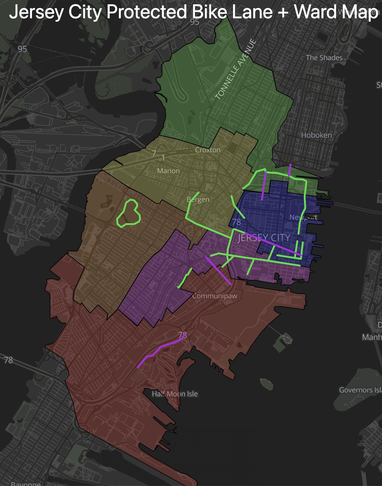
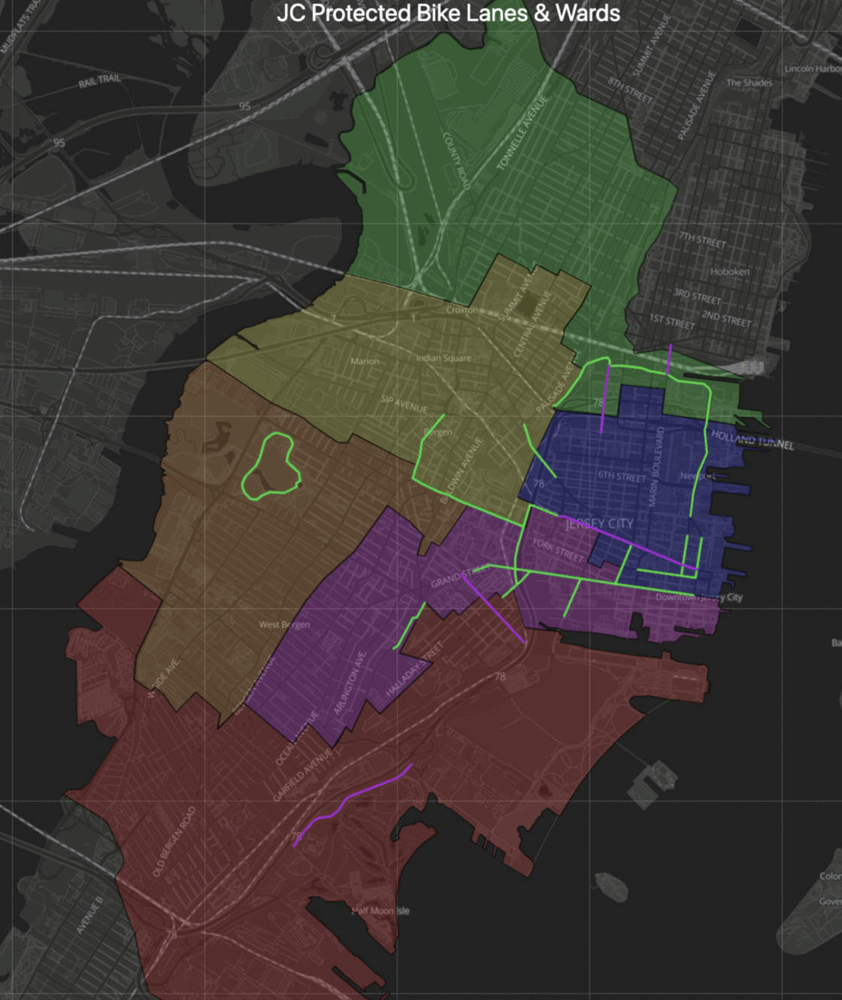

[](https://bikejc.github.io/maps/)
(purple = planned for 2022)

## Interactive version: [bikejc.github.io/maps](https://bikejc.github.io/maps/)

### Compared with the full road network <a id="pbls-vs-roads"></a>



## Scratchwork

### Process screenshots

```bash
for f in 1-pbls.png 2-roads.png; do
    convert -strip -crop 2240x2660+982+238 orig/$f cropped/$f
done
```
```bash
convert -resize 50% -delay 150 -loop 0 cropped/1-pbls.png cropped/2-roads.png pbls-roads.gif
```

### Fetch Data
Download layers from the city's arcgis server, as json:
```bash
format="json"
server="UXbywc7dSkfgdPp4"
service="JC_Bike_Network"
host="https://services2.arcgis.com"
feature_server_url="${host}/${server}/ArcGIS/rest/services/${service}/FeatureServer"

# Look up layer ID 
layer_id="$(curl "${feature_server_url}?f=${format}" | jq -r '.layers[] | .id')

# Fetch features
curl "${feature_server_url}/${layer_id}/query?f=${format}&where=1%3D1&returnGeometry=true&outFields=*&outSR=4326"
```
