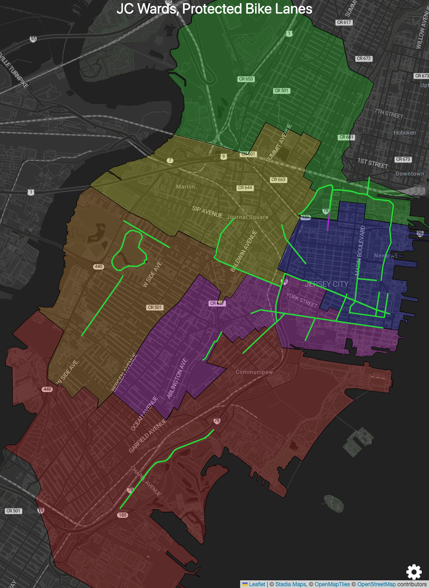

[](https://map.bikejc.org)

## Interactive version: [map.bikejc.org](https://map.bikejc.org)

### Compared with the full road network <a id="pbls-vs-roads"></a>



## Scratchwork

### Regenerate screenshots
```bash
node screenshots.js
```
Outputs to [public/screenshots](./public/screenshots).

### Make gif
```bash
cd public/screenshots
convert -delay 150 -loop 0 pbls.png pbls-roads.png pbls-vs-roads.gif
```

### Fetch Data
```bash
./download-map.py Jersey_City_Bike_Network
```
See [`download-map.py`](./download-map.py).
