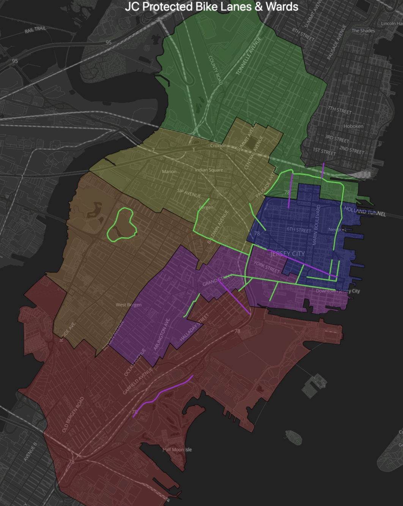

[](https://bikejc.github.io/maps/)

## Interactive version: [bikejc.github.io/maps](https://bikejc.github.io/maps/)

### Compared with the full road network <a id="pbls-vs-roads"></a>



## Scratchwork

### Process screenshots

```bash
for f in 1-pbls.png 2-roads.png; do
    convert -strip -crop 2240x2660+982+238 orig/$f cropped/$f
done
```
```bash
convert -resize 50% -delay 150 -loop 0 cropped/1-pbls.png cropped/2-roads.png pbls-roads.gif
```

### Fetch Data
See [`download-map.py`](./download-map.py).
